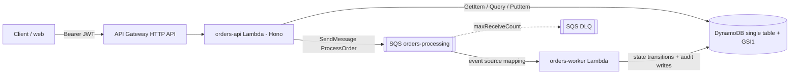

# Order Processing Platform — TCS Technical Challenge

A NodeJS/TypeScript platform that registers orders, processes them asynchronously through a
state machine, and keeps a full audit trail. pnpm workspaces monorepo with a hexagonal core, a
serverless-oriented AWS design, and a public demo frontend.

CHALLENGE: [TCS – NodeJS AWS](./CHALLENGE.md)

> Status: in progress. Built **feature-driven via OpenSpec** (no framework) — active change and
> task progress in `openspec/changes/`. Run instructions finalized during the build.

## Architecture at a glance

## Documentation

- **`openspec/changes/`** — active and archived feature changes (proposal → design → specs → tasks).
- **`docs/design.md`** — full design: architecture, user-story traceability, AWS scenario, scalability.
- **`docs/adr/`** — Architecture Decision Records.
- **`CHALLENGE.md`** — original challenge statement (WHAT/WHY).

## Monorepo layout

| Path                 | Purpose                                                          |
| -------------------- | ---------------------------------------------------------------- |
| `apps/orders-api`    | Hono HTTP edge on Lambda; entrypoint                             |
| `apps/orders-worker` | Async processor (SQS / local poll-loop)                          |
| `apps/api-docs`      | OpenAPI generation + Scalar UI                                   |
| `apps/web`           | Astro + Tailwind + DaisyUI, 3 public pages                       |
| `apps/iac`           | AWS CDK stack                                                    |
| `core/orders`        | Hexagonal core: domain, application, infrastructure, composition root |
| `core/contracts`     | Zod schemas + DTOs (single source of truth)                      |
| `core/kernel`        | Result/error types, ids, clock                                   |

## Tech

- TypeScript
- pnpm
- Backend (DynamoDB, SQS, Hono, Zod)
- IaC (AWS CDK)
- Frontend (Astro, Tailwind, DaisyUI)
