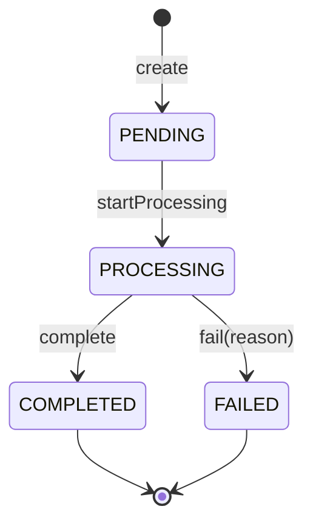

# ADR-0008: State machine with explicit orchestration

**Status:** Accepted · **Date:** 2026-06-19 · **Deciders:** Solution author

## Context

Order transitions must be valid and enforced, and creating an order must trigger its asynchronous
processing. We want this explicit and testable, with no reactive/background machinery.

## Decision

Transitions live in the **domain state machine**, enforced by guards, and are driven by explicit
command handlers. The "trigger processing after creation" step is an **explicit publish** inside
`CreateOrderHandler` (persist `PENDING` + audit, then `MessagePublisherPort.publish(ProcessOrderMessage)`)
— not an event-bus saga.

Illegal transitions throw `InvalidStateTransitionError` (→ HTTP 409).

## Options Considered

- **Explicit publish in the handler (chosen)** — one visible line; trivially unit-tested.
- **An event-bus saga** — reactive, but adds a reactive layer and the kind of implicit "magic"
  the project avoids; unneeded at this scope (one consumer).

## Trade-off Analysis

An explicit publish keeps the create→enqueue path readable and assertable; we lose the decoupling
of an event bus, which we don't need at this scope (one consumer, ADR-0006).

## Consequences

- Transitions are pure and assertable; orchestration is a single explicit call.
- No reactive layer to reason about.

## Action Items

1. [ ] `OrderStatus` guard in `domain`; transition methods return previous/next for audit.
2. [ ] `CreateOrderHandler` publishes `ProcessOrderMessage` explicitly after persisting.
