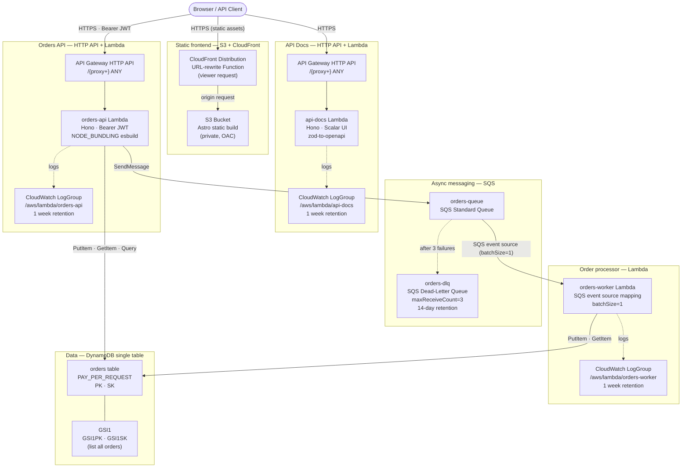
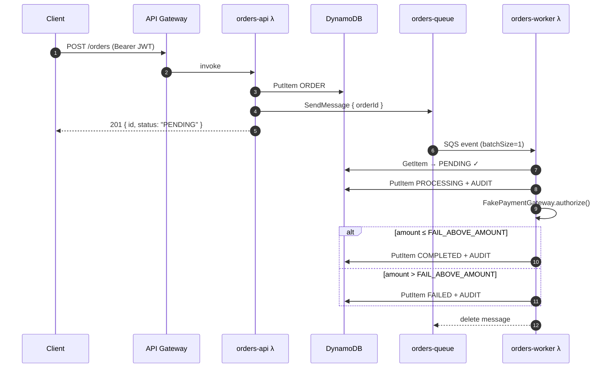
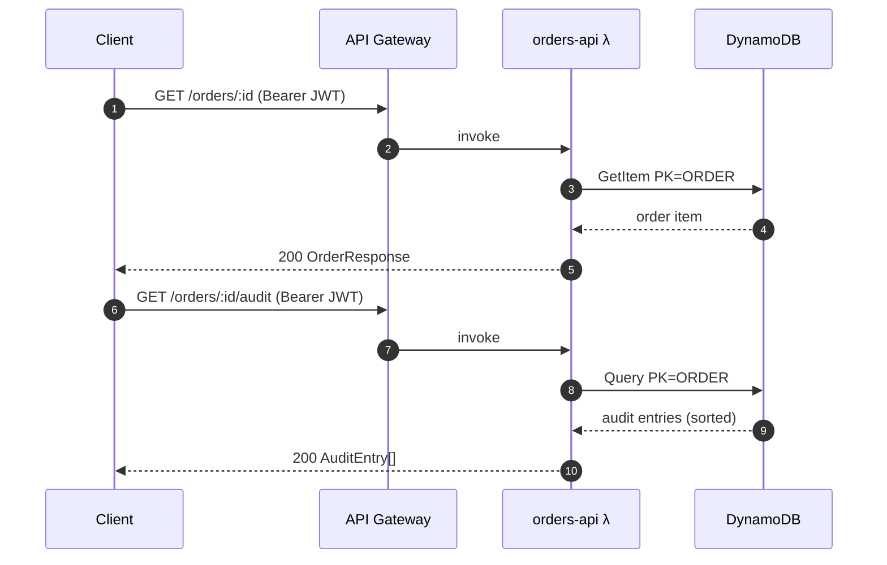

# AWS Infrastructure Diagram

> Reflects the CDK stack in `apps/iac/lib/tcs-challenge-stack.ts`.
> All resources are deployed into a single CloudFormation stack: **TcsChallengeStack**.

---

## Full topology

---

## IAM — least-privilege per Lambda

| Lambda | DynamoDB | SQS |
|--------|----------|-----|
| orders-api | `PutItem` `GetItem` `Query` | `SendMessage` |
| orders-worker | `PutItem` `GetItem` `Query` | `ReceiveMessage` `DeleteMessage` `GetQueueAttributes` |
| api-docs | — | — |

Grants are scoped to the specific table ARN and queue ARN via CDK helpers
(`table.grantReadWriteData`, `queue.grantSendMessages`, `queue.grantConsumeMessages`).

---

## Request flows

### Create + process an order

### Query order + audit trail

---

## DynamoDB single-table key schema

| Item type | PK | SK | GSI1PK | GSI1SK |
|-----------|----|----|--------|--------|
| Order | `ORDER#<id>` | `#META` | `ORDERS` | `<createdAt>#<id>` |
| Audit entry | `ORDER#<id>` | `AUDIT#<timestamp>#<event>` | — | — |

- **Get order by id** → `GetItem(PK, SK=#META)`
- **Get audit trail** → `Query(PK, SK begins_with AUDIT#)`
- **List all orders** → `Query GSI1(GSI1PK=ORDERS)` sorted by creation time

---

## CloudFormation outputs

| Output | Value |
|--------|-------|
| `OrdersApiUrl` | HTTP API endpoint for the orders API |
| `ApiDocsUrl` | HTTP API endpoint for the Scalar UI / OpenAPI spec |
| `WebUrl` | CloudFront HTTPS URL for the Astro frontend |
| `OrdersTableName` | DynamoDB table name (injected into Lambda env vars) |
| `OrdersQueueUrl` | SQS queue URL (injected into Lambda env vars) |
