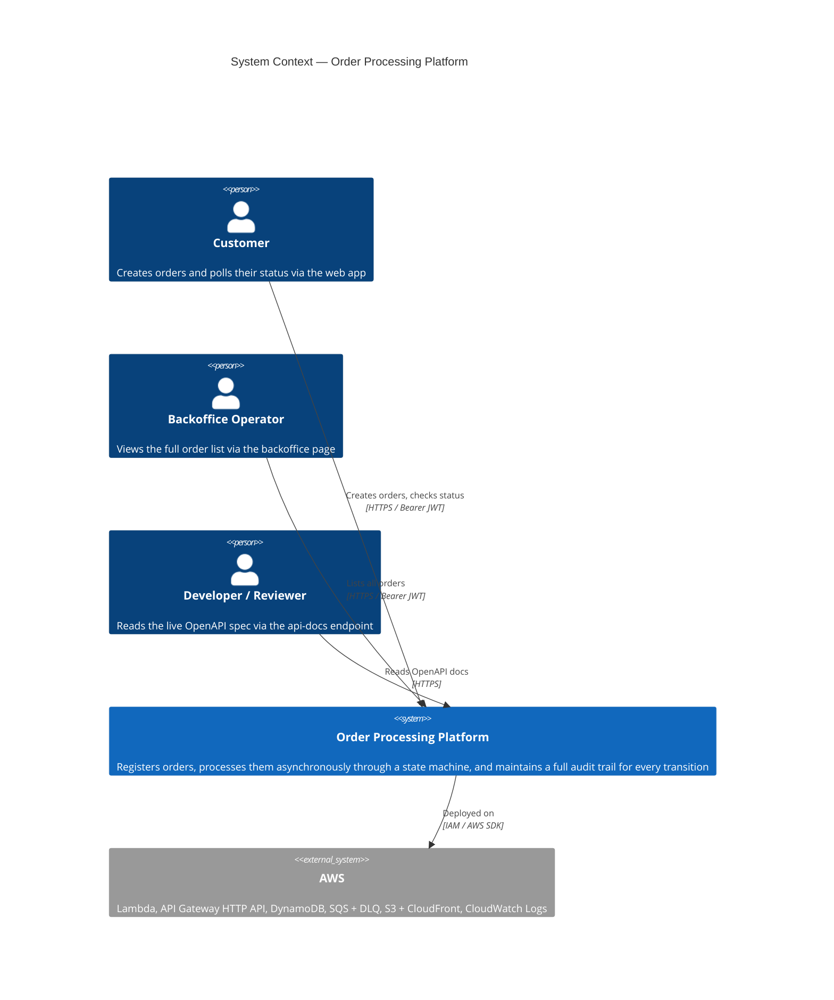
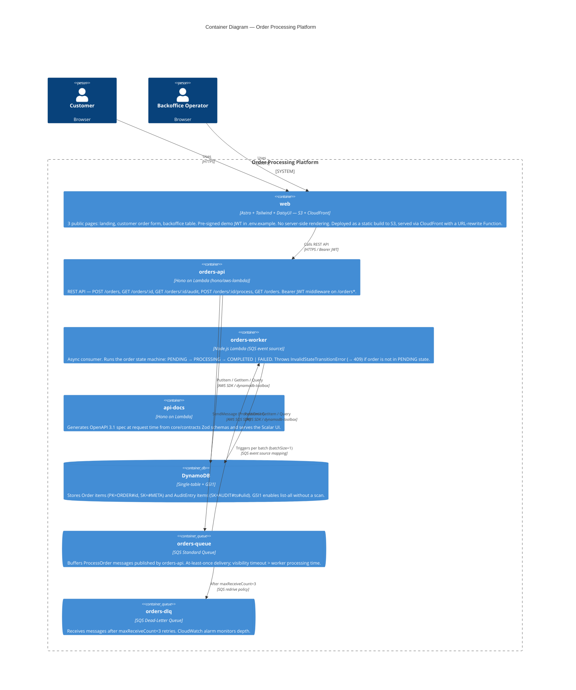
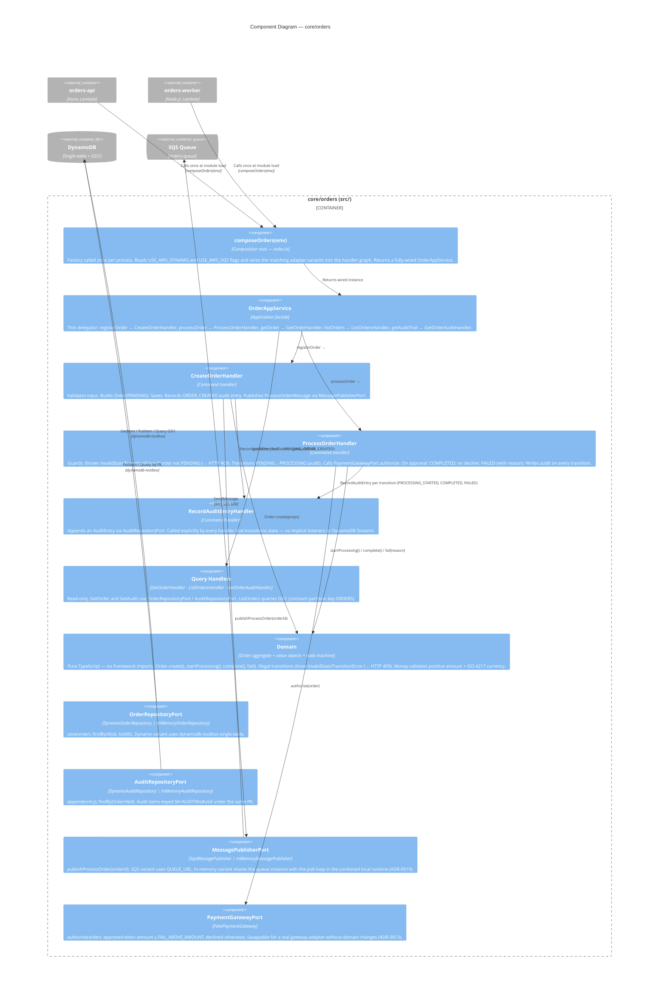

# C4 Model — Order Processing Platform

Three levels of zoom: system context → containers → components (core/orders).

---

## Level 1 — System Context

Who uses the platform and what does it talk to?

---

## Level 2 — Containers

What processes / deployable units make up the platform?

---

## Level 3 — Components (core/orders)

What are the moving parts inside the shared core package?

