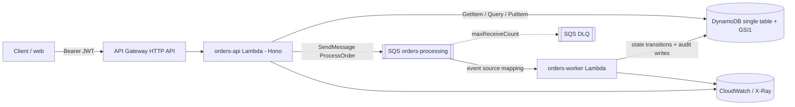
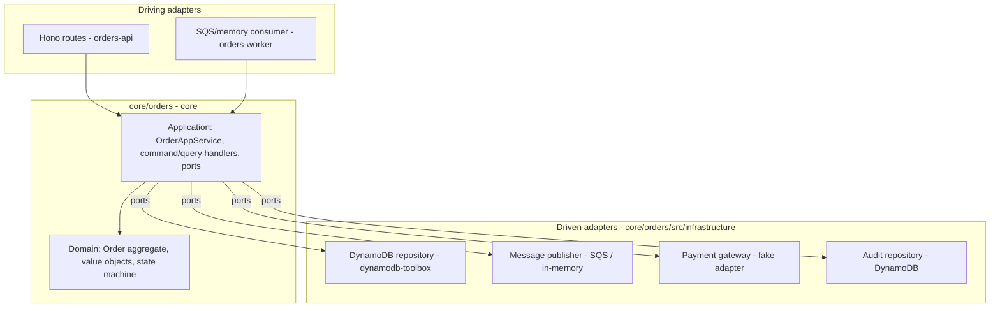
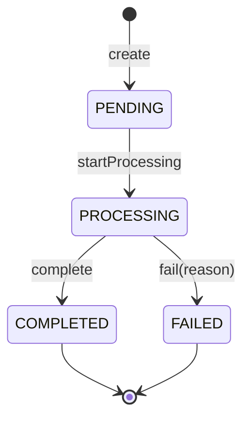

# Design — Order Processing Platform

**Status:** Proposed · **Date:** 2026-06-19
**Stack:** pnpm workspaces · TypeScript · manual composition root (no framework DI) · Hono (Lambda HTTP) · DynamoDB (dynamodb-toolbox) · SQS + DLQ · AWS CDK · Astro + Tailwind + DaisyUI

This is the narrative design. The individual decisions, with options and trade-offs, live as
ADRs in [`docs/adr/`](./adr/README.md). Feature implementation is tracked in
[`openspec/changes/`](../openspec/changes/).

---

## 1. Scope & evaluation mapping

The challenge is small in feature count (5 user stories) but graded on reasoning, not volume.
The design is optimized to make decisions legible and every functional behavior explicit and
testable.

| Evaluated            | Addressed by                                                                                              |
| -------------------- | --------------------------------------------------------------------------------------------------------- |
| API design           | Resource-oriented Hono routes, consistent HTTP codes, Zod-validated bodies, generated OpenAPI             |
| Logical modeling     | `Order` aggregate, value objects, guarded state machine; DynamoDB single-table with named access patterns |
| Backend architecture | Hexagonal layering; framework-free core; ports/adapters; manual composition root (no framework)           |
| AWS reasoning        | Serverless target (Lambda + DynamoDB + SQS) with trade-off ADRs and an evolution path                     |
| Clarity              | This doc + generated OpenAPI + per-app READMEs                                                            |
| Decision quality     | ADR set (`docs/adr/`)                                                                                     |
| Commit history       | Build sequenced into small reviewable commits (feature-driven via OpenSpec)                               |

Out of scope per the brief: full test coverage, CI/CD, production infra, UI polish.
Auth is **mock** (lightly-signed JWT).

---

## 2. Target architecture

### 2.1 Runtime topology (AWS)



The API's responsibility ends at _"order persisted as `PENDING` + `ProcessOrderMessage`
enqueued."_ Everything after runs in the worker, independently, so it can scale, retry, and
fail without touching the request path.

### 2.2 Logical layering (hexagonal)



The domain has **no framework imports**. The application defines **ports**; infrastructure
implements them; `core/orders/src/index.ts` wires them. Apps are thin driving adapters that call
`composeOrders()` and delegate to `OrderAppService`.

---

## 3. Monorepo layout

```
apps/
  orders-api/     Hono on Lambda. Routes, @hono/standard-validator, bearer middleware, health.
                  Calls composeOrders() once; delegates to OrderAppService.
  orders-worker/  SQS event Lambda (prod) / poll-loop (local). Calls composeOrders().
  api-docs/       OpenAPI from contracts (Zod -> zod-to-openapi); rendered via Scalar.
  web/            Astro + Tailwind + DaisyUI. 3 public pages. Static demo JWT.
  iac/            AWS CDK (TS). Lambdas, API GW HTTP API, DynamoDB + GSI1, SQS + DLQ, IAM.
core/
  orders/src/index.ts        composeOrders(env) — wires adapters+handlers by per-adapter flags (pure TS).
  orders/src/domain/         Order aggregate, value objects, state machine. Pure TS.
  orders/src/application/    OrderAppService, command/query handlers, ports (pure TS).
  orders/src/infrastructure/ dynamodb-toolbox repos, SQS + in-memory publisher, fake gateway.
  kernel/                    Result/error types, base classes, id/clock abstractions.
  contracts/                 Zod schemas + inferred DTOs shared by orders-api, web, api-docs.
```

`core/orders/src/application` exposes `OrderAppService` as the single core surface; `core/orders/src/index.ts`
wires it (ports→adapters, per-adapter flags) so both apps consume the same facade.

---

## 4. Decisions

Each decision is recorded as an ADR with options, a dimension table, and trade-offs. See the
index at [`docs/adr/README.md`](./adr/README.md). Summary:

| ADR  | Decision                                                                 |
| ---- | ------------------------------------------------------------------------ |
| 0001 | pnpm workspaces monorepo                                                 |
| 0002 | Hono on Lambda as the HTTP entrypoint                                    |
| 0003 | Manual composition root (no framework DI)                                |
| 0004 | Hexagonal layering with an `OrderAppService` facade                      |
| 0005 | DynamoDB + dynamodb-toolbox, single-table design                         |
| 0006 | SQS + DLQ for async processing (vs SNS / EventBridge)                    |
| 0007 | Plain command/query handlers + cross-process transport                   |
| 0008 | State machine with explicit orchestration                                |
| 0009 | Explicit audit via command (not DynamoDB Streams)                        |
| 0010 | Local in-memory transport ⇒ combined local runtime                       |
| 0011 | AWS CDK for IaC (vs Terraform)                                           |
| 0012 | Contracts single source of truth (Zod → OpenAPI)                         |
| 0013 | `PaymentGatewayPort` as the FAILED trigger                               |
| 0014 | Minor decisions log                                                      |
| 0015 | ESLint + Prettier for code style; boundaries by code discipline + review |
| 0016 | Adapter selection by per-adapter env flags (composition root)            |

---

## 5. Build spec

### 5.1 Domain (`core/orders/src/domain`)

**Value objects**

- `OrderId` — UUID; `create()` / `from(string)`.
- `CustomerId` — non-empty string.
- `Money` — `{ amount: number; currency: string }`; rejects non-positive amounts and
  non-ISO-4217 currencies.
- `OrderStatus` — `PENDING | PROCESSING | COMPLETED | FAILED` + transition guard.

**Aggregate `Order`**

- Fields: `id, customerId, money, status, createdAt, updatedAt, failureReason?`.
- `static create(props): Order` → `PENDING`, stamps `createdAt` and `updatedAt`.
- `startProcessing()` → guard `PENDING→PROCESSING`, returns `{ previous, next }`.
- `complete()` → guard `PROCESSING→COMPLETED`.
- `fail(reason)` → guard `PROCESSING→FAILED`.
- Illegal transitions throw `InvalidStateTransitionError`.

**State machine**



**Audit**

- `AuditEntry { orderId, event, previousState, newState, timestamp, reason? }`.
- Events: `ORDER_CREATED`, `ORDER_PROCESSING_STARTED`, `ORDER_COMPLETED`, `ORDER_FAILED`.

### 5.2 Application (`core/orders/src/application`)

**Ports**

- `OrderRepositoryPort` — `save(order)`, `findById(id)`, `listAll()`.
- `AuditRepositoryPort` — `append(entry)`, `findByOrderId(id)`.
- `MessagePublisherPort` — `publishProcessOrder(orderId)`.
- `PaymentGatewayPort` — `authorize(order): Promise<{ approved: boolean; reason?: string }>`.
- `ClockPort`, `IdGeneratorPort` — deterministic tests.

**Command handlers (plain classes)**

- `CreateOrderHandler`: validate, build `Order(PENDING)`, `repo.save`, call
  `RecordAuditEntryHandler(null→PENDING, ORDER_CREATED)`, then **publish `ProcessOrderMessage`**
  via `MessagePublisherPort` (explicit orchestration — no event-bus saga). Returns created `Order`.
- `ProcessOrderHandler`:
  1. `repo.findById`; **idempotency guard** — no-op if not `PENDING`.
  2. `order.startProcessing()` → audit `ORDER_PROCESSING_STARTED` → save.
  3. `const result = await paymentGateway.authorize(order)`.
  4. If `result.approved` → `order.complete()` → audit `ORDER_COMPLETED` → save.
     Else → `order.fail(result.reason)` → audit `ORDER_FAILED` (with reason) → save.
  - Transport/infra errors thrown here bubble up for SQS retry → DLQ (distinct from a
    business `FAILED`).
- `RecordAuditEntryHandler`: `audit.append`.

**Query handlers (plain classes)**

- `GetOrderHandler`: `findById` or throw `OrderNotFoundError` (→ 404).
- `ListOrdersHandler`: `listAll()` (GSI1).
- `GetOrderAuditHandler`: trail by orderId.

**Facade**

- `OrderAppService` holds the handler instances and delegates each method
  (`registerOrder`, `getOrder`, `listOrders`, `processOrder`, audit trail) directly to the matching
  handler. No framework bus.

### 5.3 Infrastructure (`core/orders/src/infrastructure`)

- `DynamoOrderRepository`, `DynamoAuditRepository` (dynamodb-toolbox; single table + GSI1).
- `SqsMessagePublisher` (prod) + `InMemoryMessagePublisher` (local) → `MessagePublisherPort`.
- `FakePaymentGateway` → `PaymentGatewayPort`: declines when `amount > FAIL_ABOVE_AMOUNT`,
  otherwise approves. This is the explicit, swappable source of `FAILED` (see ADR-0013).
- `InMemoryOrderRepository`, `InMemoryAuditRepository`, `InMemoryMessagePublisher` — the local
  adapters. Plain classes; `core/orders/src/index.ts` builds them.
- `SystemClock`, `UuidGenerator`.

### 5.3b Composition (`core/orders/src/index.ts`)

- `composeOrders(env)` — constructs the adapters and use-case handlers, wires them by hand
  (constructor injection), and returns the wired `OrderAppService`. Selects each adapter **by
  per-adapter flag** (`USE_AWS_SQS`, `USE_AWS_DYNAMO`) from typed config. Pure TypeScript, no
  framework, the only place that knows concrete adapters (ADR-0003, ADR-0016).

### 5.4 Apps

Each app calls `composeOrders(env)` at module load, gets the `OrderAppService`, and passes it to its
driving adapter. No app duplicates wiring; in-memory vs AWS is an env-flag change, not code. There
is no framework context to boot.

**`orders-api` (Hono / Lambda)** — `composeOrders()` once at module load (reused on warm
invocations); routes in §6; bearer middleware; maps domain errors to HTTP codes; unauthenticated health.

**`orders-worker`** — the async half; `composeOrders()` once, then consumes messages.

- _Local:_ poll-loop over the shared in-memory queue (combined runtime, ADR-0010); flags false.
- _AWS:_ Lambda with an **SQS event source mapping**; invoked per batch, no poll loop; flags true.
- Per message: parse `ProcessOrderMessage` → `OrderAppService.processOrder(orderId)`.
  Idempotent; thrown errors → redelivery → DLQ after `maxReceiveCount` (partial batch response).

---

## 6. User-story → implementation traceability

| HU                    | Endpoint / mechanism                    | Command/Query → Handler                                                                                    | Persistence           | HTTP codes            |
| --------------------- | --------------------------------------- | ---------------------------------------------------------------------------------------------------------- | --------------------- | --------------------- |
| Registrar orden       | `POST /orders`                          | `CreateOrderCommand` → `CreateOrderHandler` (`PENDING`, validation, audit `ORDER_CREATED`)                 | PutItem order + audit | 201 / 400 / 401       |
| Consultar orden       | `GET /orders/:id` (+ `/audit`)          | `GetOrderQuery` → `GetOrderHandler`                                                                        | GetItem / Query       | 200 / 401 / 404       |
| Procesar orden        | `POST /orders/:id/process` + SQS worker | publish → `ProcessOrderCommand` → `ProcessOrderHandler` (state machine, idempotent, gateway-driven FAILED) | PutItem + audit       | 202 / 401 / 404 / 409 |
| Registrar auditoría   | implicit on every transition            | `RecordAuditEntryCommand` → `RecordAuditEntryHandler`                                                      | PutItem audit         | n/a                   |
| Seguridad básica      | bearer middleware on `/orders*`         | JWT HMAC verify (signature + exp)                                                                          | n/a                   | 401                   |
| Backoffice list (web) | `GET /orders`                           | `ListOrdersQuery` → `ListOrdersHandler` (GSI1)                                                             | Query GSI1            | 200 / 401             |

### API contract (summary)

| Method | Path                  | Auth   | Body (Zod)                         | Success                                                       |
| ------ | --------------------- | ------ | ---------------------------------- | ------------------------------------------------------------- |
| POST   | `/orders`             | Bearer | `{ customerId, amount, currency }` | `201 { id, status, customerId, amount, currency, createdAt, updatedAt }` |
| GET    | `/orders/:id`         | Bearer | —                                  | `200 OrderResponse` (includes `failureReason` when `FAILED`)  |
| GET    | `/orders/:id/audit`   | Bearer | —                                  | `200 AuditEntry[]`                                            |
| GET    | `/orders`             | Bearer | —                                  | `200 OrderResponse[]`                                         |
| POST   | `/orders/:id/process` | Bearer | —                                  | `202 { id, status }`                                          |
| GET    | `/health`             | none   | —                                  | `200 { status: "ok" }`                                        |

Error envelope: `{ error: { code, message } }`. `InvalidStateTransitionError → 409`,
`OrderNotFoundError → 404`, validation → `400`, auth → `401`.

---

## 7. DynamoDB single-table design

| Pattern                      | Operation  | Keys                                                  |
| ---------------------------- | ---------- | ----------------------------------------------------- |
| Get order by id              | GetItem    | `PK = ORDER#<id>`, `SK = #META`                       |
| Get order + audit trail      | Query      | `PK = ORDER#<id>` (SK `begins_with AUDIT#` for trail) |
| List all orders (backoffice) | Query GSI1 | `GSI1PK = ORDERS`, `GSI1SK = <createdAt>#<id>`        |

Audit items: `PK = ORDER#<id>`, `SK = AUDIT#<timestamp>#<ulid>`. The constant GSI1 partition
enables "list all" without a scan; see §9 for the hot-partition caveat at scale.

---

## 8. Local development & Docker

`docker compose` services: `dynamodb-local`, optional `dynamodb-admin`, and the **combined
local app** (Hono + worker poll-loop in one process sharing the in-memory queue, ADR-0010).
A bootstrap script creates the table + GSI1. `pnpm token` mints a demo JWT. README documents
the create → process → query → audit walkthrough.

---

## 9. AWS deployment scenario

**Compute.** Lambda for API and worker: pay-per-use, scales to zero and out with concurrency.
Trade-off vs Fargate — Fargate avoids cold starts and suits sustained load; order traffic is
spiky and event-driven, so Lambda wins. Cold-start mitigation: tiny Hono edge, minimal deps,
provisioned concurrency if latency-sensitive.

**API edge.** API Gateway **HTTP API** (cheaper/faster than REST API). Production auth path:
API GW **JWT authorizer** backed by Cognito, replacing the mock middleware with no domain change.

**Data.** DynamoDB **on-demand** — no capacity planning, single-digit-ms reads. "List all"
via **GSI1** (constant partition `ORDERS`). Caveat at scale: a constant GSI partition can go
hot; the production answer is a **sharded GSI partition** (`ORDERS#<shard>`) or a
paginated/filtered list. Noted for evolution.

**Messaging.** SQS standard + DLQ. Visibility timeout > worker processing time;
`maxReceiveCount` (e.g. 3) → DLQ; CloudWatch alarm on DLQ depth. Standard (not FIFO) since
ordering/dedup isn't required; idempotent consumer covers at-least-once.

**Audit.** Explicit writes (ADR-0009). Evolution: emit `OrderStatusChanged` to **EventBridge**
for multi-subscriber fan-out (preferred over SNS for app events: content routing, schema
registry, replay).

**Security.** Mock JWT now → Cognito + API GW authorizer later; JWT secret in **Secrets
Manager**; least-privilege IAM per Lambda (API: `PutItem/GetItem/Query` + `sqs:SendMessage`;
worker: `PutItem/GetItem` + `sqs:ReceiveMessage/DeleteMessage`); VPC endpoints only if Lambdas
are placed in a VPC.

**Observability.** Structured CloudWatch logs, X-Ray across API→SQS→worker, alarms on DLQ
depth, Lambda errors, throttles.

---

## 10. Scalability

DynamoDB on-demand scales reads/writes. SQS absorbs spikes and provides backpressure — the API
stays fast because it only enqueues; the worker drains at its own concurrency. Lambda scales
horizontally with reserved/limited concurrency to protect downstreams. Known bottleneck
(hot GSI partition for "list all") and remedies are in §9.

---

## 11. Bonus deliverables

- **`api-docs`** — `openapi.json` from `contracts` (Zod → `zod-to-openapi`), rendered with Scalar.
- **`iac`** — AWS CDK stack: DynamoDB + GSI1, SQS + DLQ, `orders-api` Lambda + HTTP API,
  `orders-worker` Lambda + SQS event source mapping, IAM, secret reference.
- **`web`** — Astro + Tailwind + DaisyUI, public, three pages:
  1. `/` — landing, two buttons: _Customer_ / _Backoffice_.
  2. `/customer` — create an order; look up an order by id (status + timestamps).
  3. `/backoffice` — table of all orders (`GET /orders`): id, customerId, amount, status,
     createdAt; refresh; optional audit view.
     Calls the API with a static demo JWT.

---

## 12. Future improvements

EventBridge fan-out for `OrderStatusChanged`; Cognito real auth; sharded GSI or alternate list
strategy; FIFO queue if ordering/dedup is ever required; provisioned concurrency for latency
SLAs; contract/integration tests with LocalStack; CI/CD with pnpm filtering or NX (future).

---

## 13. Resolved assumptions

- **Simulated processing / FAILED trigger:** the worker calls `PaymentGatewayPort.authorize`;
  the fake adapter declines when `amount > FAIL_ABOVE_AMOUNT` (env, default 10000), otherwise
  approves. Deterministic, demoable, testable, and architecturally honest (ADR-0013).
- **Creation audit:** an `ORDER_CREATED` entry is recorded for the initial `null → PENDING`
  state for full traceability.
- **Backoffice list:** `web` reads `GET /orders` (added beyond the 5 HUs to satisfy the table page).
